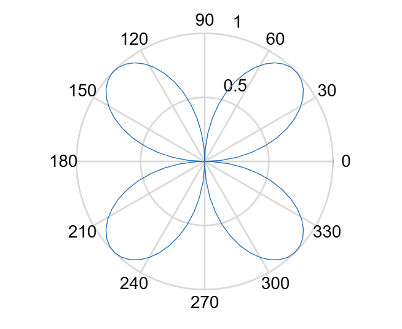
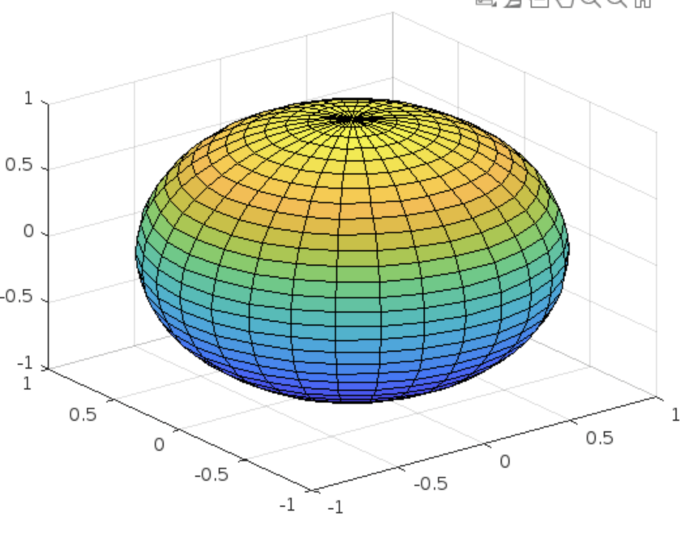

# 数据类型
默认显示运算结果，但在赋值语句后加分号只执行赋值操作

## 数值
双精度与单精度：double, single
符号整型与无符号整型：int8, unit8
实型与复型：real, imag

## 结构
structure

## 元胞
cell

% 注释

## format
> format 只影响输出格式不影响数据存储

|代码   |含义   |
|---|---|
|`format `  |显示小数点后4位   |
|`format long` | 小数点后15位|
|`format short e`| 5位有效数字科学计数法|
|`format long e`| 16位有效数字科学计数法|
|`format rat`|近似有理数|


```matlab

% 小数点后4位
>> format
>> pi

ans =

    3.1416

% 小数点后15位
>> format long
>> pi

ans =

   3.141592653589793

% 5位有效数字的科学计数法
>> format short e
>> pi

ans =

   3.1416e+00

% 16位有效数字的科学计数法
>> format long e
>> pi

ans =

     3.141592653589793e+00

% 近似有理数
>> format rat
>> pi

ans =

     355/113   
```

## 预定义变量
|变量名   |表示数值   |
|---|---|
| `ans ` | 缺省变量名  |
| `pi `| 圆周率|
|`eps` | 浮点运算的相对精度|
|`inf `| 正无穷|
|`NaN` | 不定值0/0|
|`realmax/realmin`|最大/最小的浮点数|
|`i,j`|虚数单位|
|`nargin,nargout`|所用函数的输入/输出变量数目|


```matlab
>> 1

ans =

     1

>> pi

ans =

    3.1416

>> eps

ans =

   2.2204e-16

>> inf

ans =

   Inf

>> NaN

ans =

   NaN

>> realmax

ans =

  1.7977e+308

>> realmin

ans =

  2.2251e-308

>> i

ans =

   0.0000 + 1.0000i

>> j

ans =

   0.0000 + 1.0000i
```

## 内存变量的管理
`whos`, `who`显示workspace中的变量名，`clear`删除workspace中的所有变量
```matlab
>> a=1,b=2

a =

     1


b =

     2

>> who

您的变量为:

a  b  

>> whos
  Name      Size            Bytes  Class     Attributes

  a         1x1                 8  double              
  b         1x1                 8  double

>> clear
>> whos
>>           
```

## 逻辑运算与关系运算
### 逻辑运算
|运算符|含义|
|---|---|
|`&`|与|
|`\|`|或|
|`~`|非|
### 关系运算
| 运算符 | 含义 |
|---|---|
| `>`  | 大于  |
|`<`|小于|
|`>=`|大于等于|
|`<=`|小于等于|
|`==`|等于|
|`~=`|不等于|


## 序列
```matlab
% 从1开始到4结束每隔0.5取一个
>> 1:0.5:4

ans =

    1.0000    1.5000    2.0000    2.5000    3.0000    3.5000    4.0000

% 从1开始到2结束一共有10个等差的数
>> linspace(1,2,10)

ans =

    1.0000    1.1111    1.2222    1.3333    1.4444    1.5556    1.6667    1.7778    1.8889    2.0000

% 从10^1开始到10^2结束一共有10个等比的数
>> logspace(1,2,10)

ans =

   10.0000   12.9155   16.6810   21.5443   27.8256   35.9381   46.4159   59.9484   77.4264  100.0000
   
```

## 矩阵
matlab中的矩阵是按列存放的，也就是说你如果用序列创建矩阵，是一列一列依次填满的。
### 创建矩阵
方括号括起来表示矩阵，分号表示换行，同行元素间以空格或逗号隔开，矩阵元素可以是运算表达式
```matlab
>> mat = [1 2 3 ; 4 5 6]

mat =

     1     2     3
     4     5     6
```


### 特殊矩阵的创建
|函数   |作用   |
|---|---|
|`zeors(m,n)`   |产生$m\times n$零矩阵，方阵情况时可以省略第二个参数   |
|`zeros(size(A))`|产生与矩阵A同样大小的零矩阵|
|`eye(m,n)`|构建单位矩阵|
|`ones(m,n)`|构建全1矩阵|
|`randi([a, b], m, n)`|元素在[a, b]之间的$m\times n$随机矩阵|
```matlab
>> zeros(3,4)

ans =

     0     0     0     0
     0     0     0     0
     0     0     0     0

>> eye(3,4)

ans =

     1     0     0     0
     0     1     0     0
     0     0     1     0

>> ones(3,4)

ans =

     1     1     1     1
     1     1     1     1
     1     1     1     1

>> randi([10,50], 5 ,5)

ans =

    47    21    49    27    11
    15    32    49    47    44
    47    49    29    42    48
    35    49    42    49    37
    13    16    15    36    41

```

### 利用 M 文件或 TXT 文件建立矩阵

可以通过 `.m` 脚本文件或 `.txt` 文本文件创建较大、复杂的矩阵。这样做的好处是便于维护、复用或从外部导入数据。

#### 使用 `.m` 文件创建矩阵

1. 打开 MATLAB 自带的 **Editor** 或使用任意文本编辑器。
2. 输入如下内容（定义一个矩阵 `mymat`）：

    ```matlab
    % 文件名：mymatrix.m
    mymat = [
        1, 2, 3;
        4, 5, 6;
        7, 8, 9
    ];
    ```

3. 将文件保存为 `mymatrix.m`，并确保保存在 MATLAB 当前工作目录中。


    ```matlab
    >> mymat

    mymat =

         1     2     3
         4     5     6
         7     8     9
    ```

#### 使用 `.txt` 文件读取纯数据矩阵

适用于数据文件中只包含纯数字（不含变量名）。

1. 创建一个名为 `mymatrix.txt` 的文本文件，内容如下：

    ```
    1 2 3
    4 5 6
    7 8 9
    ```

2. 在 MATLAB 中读取该文件内容为矩阵：

    ```matlab
    mymat = load('mymatrix.txt');
    ```

    或使用更通用的函数：

    ```matlab
    mymat = readmatrix('mymatrix.txt');
    ```

### 矩阵切片
#### MATLAB 中的矩阵切片（索引）操作
矩阵的切片操作使用括号 `( , )` 表示，其中：
- 前一部分表示 **行的索引**；
- 后一部分表示 **列的索引**；
- 可以使用数字、向量、冒号 `:`、关键字 `end` 等方式指定位置。

#### 基本语法

```matlab
A(i, j)           % 取第 i 行第 j 列的元素
A(i, :)           % 取第 i 行的所有列
A(:, j)           % 取第 j 列的所有行
A(m:n, p:q)       % 取第 m 到 n 行、第 p 到 q 列的子矩阵
A([1 3], [2 4])   % 取第 1、3 行 和第 2、4 列交叉形成的子矩阵
A(end, :)         % 取最后一行的所有列
A(:, end-1:end)   % 取最后两列的所有行
```
```matlab
>> A = [1 2 3; 4 5 6; 7 8 9]

A =

     1     2     3
     4     5     6
     7     8     9

>> A(2, 3)

ans =

     6

>> A(1, :)

ans =

     1     2     3

>> A(:, 2)

ans =

     2
     5
     8

>> A(1:2, 2:3)

ans =

     2     3
     5     6

>> A([1 3], [1 3])

ans =

     1     3
     7     9

>> 

>> A(end, :)

ans =

     7     8     9

>> A(:, end-1:end)

ans =

     2     3
     5     6
     8     9

```

### 矩阵运算
数的运算是矩阵运算的特例，所以一并包含在其中。

#### 1. 基础算术运算符

| 运算符 | 含义        | 说明                         |
|--------|-------------|------------------------------|
| `+`    | 加法        | 元素逐项相加，要求维度一致  |
| `-`    | 减法        | 元素逐项相减，要求维度一致  |
| `*`    | 矩阵乘法    | 矩阵内积规则，A的列= B的行  |
| `/`    | 右除        | `A/B` ≡ `A * inv(B)`         |
| `\`    | 左除        | `A\B` ≡ `inv(A) * B`         |
| `^`    | 矩阵幂      | `A^n` 为 `n` 次矩阵乘法      |

```matlab
>> A = [1 2; 3 4], B = [5 6; 7 8]

A =

     1     2
     3     4


B =

     5     6
     7     8

>> A + B

ans =

     6     8
    10    12

>> A - B

ans =

    -4    -4
    -4    -4

>> A * B

ans =

    19    22
    43    50

>> A / B

ans =

    3.0000   -2.0000
    2.0000   -1.0000

>> A / B * B

ans =

     1     2
     3     4

>> A \ B

ans =

    -3    -4
     4     5

>> A * (A \ B)

ans =

     5     6
     7     8

>> A ^ 2

ans =

     7    10
    15    22

```

#### 2. 点运算符（逐元素操作）

| 运算符 | 含义        |
|--------|-------------|
| `.*`   | 元素乘法    |
| `./`   | 元素右除    |
| `.\`   | 元素左除    |
| `.^`   | 元素幂      |
```matlab
>> A = [1 2; 3 4], B = [5 6; 7 8]

A =

     1     2
     3     4


B =

     5     6
     7     8

>> A .* B

ans =

     5    12
    21    32

>> A ./ B

ans =

    0.2000    0.3333
    0.4286    0.5000

>> A .\ B

ans =

    5.0000    3.0000
    2.3333    2.0000

>> A .^ 2

ans =

     1     4
     9    16

```

#### 3. 常用数学函数
下述函数若作用于矩阵则是对每一元素进行的。
| 函数     | 说明             |
|----------|------------------|
| `sqrt(x)`| 平方根           |
| `pow2(x)`| 2的幂|
| `log(x)`| 自然对数|
| `log2(x)`| 2为底的对数|
| `log10(x)`| 10为底的对数|
| `exp(x)`| e为底的指数|
| `sign(x)`| 符号函数         |
| `mod(x,y)` | 余数，x为负数时是向负数的余数       |
| `rem(x,y)` | 余数，x为负数时是向正数的余数     |
| `round(x)`| 四舍五入        |
| `floor(x)`| 向下取整        |
| `ceil(x)` | 向上取整        |
| `fix(x)`  | 向 0 方向取整    |
| `conj(x)`| 复数共轭|
| `real(x)`| 复数实部|
| `imag(x)`| 复数虚部|
| `abs(x)` |模|
| `angle(x)`| 相角|
```matlab
>> sqrt([4 9])

ans =

     2     3

>> pow2([1 2 3])

ans =

     2     4     8

>> log(exp(1))

ans =

     1

>> log2(8)

ans =

     3

>> log10(100)

ans =

     2

>> exp(1)

ans =

    2.7183

>> sign([-3 0 4])

ans =

    -1     0     1

>> mod(-7, 3)

ans =

     2

>> rem(-7, 3)

ans =

    -1

>> round(3.6)

ans =

     4

>> round(3.4)

ans =

     3

>> floor(3.6)

ans =

     3

>> ceil(3.2)

ans =

     4

>> fix(-3.7)

ans =

    -3

>> fix(3.7)

ans =

     3

>> conj(1+2i)

ans =

   1.0000 - 2.0000i

>> real(1+2i)

ans =

     1

>> imag(1+2i)

ans =

     2

>> abs(3+4i)

ans =

     5

>> angle(pi/4)

ans =

     0

```

#### 4. 矩阵变换函数

| 函数        | 说明                  |
|-------------|-----------------------|
| `transpose(A)` 或 `A.'` | 非共轭转置 |
| `fliplr(A)`     | 左右翻转          |
| `flipud(A)`     | 上下翻转          |
| `flipdim(A,1)`     | 将矩阵按第一个维度进行翻转  |
| `rot90(A)`    |旋转90度 |
| `diag(A)`|对角矩阵 |
| `rref(A)`| 最简行阶梯形矩阵|
| `tril(A)`|下三角矩阵 |
| `triu(A)`|上三角矩阵 |
|`reshape(A,m,n)`|将矩阵A重新排成$m\times n$的矩阵|
```matlab
>> A = [1 2; 3 4]

A =

     1     2
     3     4

>> transpose(A)

ans =

     1     3
     2     4

>> A.'

ans =

     1     3
     2     4

>> fliplr(A)

ans =

     2     1
     4     3

>> flipud(A)

ans =

     3     4
     1     2

>> flipdim(A, 1)

ans =

     3     4
     1     2

>> flipdim(A, 2)

ans =

     2     1
     4     3

>> rot90(A)

ans =

     2     4
     1     3

>> diag(A)

ans =

     1
     4

>> rref(A)

ans =

     1     0
     0     1

>> tril(A)

ans =

     1     0
     3     4

>> triu(A)

ans =

     1     2
     0     4

>> reshape(A, 1, 4)

ans =

     1     3     2     4

```
#### 5. 矩阵运算函数

| 函数     | 含义                 |
|----------|----------------------|
| `det(A)` | 行列式               |
| `inv(A)` | 逆矩阵               |
| `rank(A)`| 矩阵秩               |
| `trace(A)`| 对角线元素之和     |
| `norm(A)`|矩阵范数|
| `cond(A)`| 矩阵条件数|
|`[V,D]=eig(A)`|矩阵的特征值分解，`V`表示特征向量，`D`表示特征值|
| `[Q,R]=qr(A)`|矩阵的QR分解|
| `[L,U]=lu(A)`|矩阵的LU分解|

```matlab
>> det([1 2; 3 4])

ans =

    -2

>> inv([1 2; 3 4])

ans =

   -2.0000    1.0000
    1.5000   -0.5000

>> rank([1 2; 2 4])

ans =

     1

>> trace([1 2; 3 4])

ans =

     5

>> norm([3 4])

ans =

     5

>> cond([1 2; 3 4])

ans =

   14.9330

>> [V,D] = eig([1 2; 3 4])

V =

   -0.8246   -0.4160
    0.5658   -0.9094


D =

   -0.3723         0
         0    5.3723

>> [Q,R] = qr([1 2; 3 4])

Q =

   -0.3162   -0.9487
   -0.9487    0.3162


R =

   -3.1623   -4.4272
         0   -0.6325

>> [L,U] = lu([1 2; 3 4])

L =

    0.3333    1.0000
    1.0000         0


U =

    3.0000    4.0000
         0    0.6667

```
#### 6.向量内积/外积
| 函数        | 主要作用 |
| `dot`     | 点积      |
| `cross`   | 叉积      |
```matlab
>> dot([1 2 3], [4 5 6])

ans =

    32

>> cross([1 2 3], [4 5 6])

ans =

    -3     6    -3

```
#### 7.其他函数
| 函数        | 主要作用    | 向量行为    | 矩阵行为（默认）   |
| --------- | ------- | ------- | ---------- |
| `min/max` | 极值      | 单值      | 每列最值       |
| `mean`    | 平均值     | 单值      | 每列均值       |
| `median`  | 中位数     | 单值      | 每列中位数      |
| `std`     | 标准差     | 单值      | 每列标准差      |
| `diff`    | 相邻差分    | 长度减1    | 每列差分       |
| `sort`    | 升序排序    | 排序向量    | 每列排序       |
| `sum`     | 求和      | 总和      | 每列求和       |
| `prod`    | 乘积      | 累乘      | 每列累乘       |
| `cumsum`  | 累加和     | 向量累加    | 每列累加       |
| `cumprod` | 累乘积     | 向量累乘    | 每列累乘       |
| `length`  | 最大维长度   | 向量长度    | 二维矩阵为max(行,列)   |
| `size`    | 维度信息    | [1,n]  | [m,n]     |
| `norm`    | 向量/矩阵范数 | L2 范数   | 谱范数（最大奇异值） |
```matlab
>> A = reshape(1:16, 4, 4)

A =

     1     5     9    13
     2     6    10    14
     3     7    11    15
     4     8    12    16

>> min(A)

ans =

     1     5     9    13

>> max(A)

ans =

     4     8    12    16

>> mean(A)

ans =

    2.5000    6.5000   10.5000   14.5000

>> median(A)

ans =

    2.5000    6.5000   10.5000   14.5000

>> std(A)

ans =

    1.2910    1.2910    1.2910    1.2910

>> diff(A)

ans =

     1     1     1     1
     1     1     1     1
     1     1     1     1

>> sort(A)

ans =

     1     5     9    13
     2     6    10    14
     3     7    11    15
     4     8    12    16

>> sum(A)

ans =

    10    26    42    58

>> prod(A)

ans =

          24        1680       11880       43680

>> cumsum(A)

ans =

     1     5     9    13
     3    11    19    27
     6    18    30    42
    10    26    42    58

>> cumprod(A)

ans =

           1           5           9          13
           2          30          90         182
           6         210         990        2730
          24        1680       11880       43680

>> length(A)

ans =

     4

>> size(A)

ans =

     4     4

>> norm(A)

ans =

   38.6227

```

## 字符串
### 创建字符串以及字符串数组
单引号将内容括起来表示一个字符串，以ASC2码存储。
```matlab
% 创建字符串
a = 'ABC'
% 创建字符串数组，不可以使用单引号，否则输出会是字符串
>> a = ["hello" "word"]

a = 

  1x2 string 数组

    "hello"    "word"

>> a = ['hello', 'word']

a =

    'helloword'

```
### 字符函数
| 函数                          | 含义                                                                 |
|-------------------------------|----------------------------------------------------------------------|
| `abs('ABC')`                  | 返回字符串中每个字符的 ASCII 码（与 `double` 等价）                 |
| `double('ABC')`               | 返回字符串中每个字符的 ASCII 码                                     |
| `char([65 66 67])`            | 将 ASCII 数字转换为对应字符，结果为 `'ABC'`                         |
| `int2str(123)`                | 将整数转换为字符串 `'123'`                                          |
| `num2str(3.14)`               | 将数值（整数或浮点数）转换为字符串 `'3.14'`                         |
| `str2num('1.23 4.56')`        | 将字符串解析为数值向量 `[1.23 4.56]`                                |
| `strcat('ab', 'cd')`          | 字符串拼接，结果为 `'abcd'`，自动去除尾部空格                      |
| `strvcat('abc', 'defg')`      | 垂直拼接字符矩阵，按最大长度补空格                                 |
| `strcmp('abc','abc')`         | 比较字符串是否完全相同，返回 `1`（true）或 `0`（false）             |
| `strncmp('abcdef','abcxyz',3)`| 比较字符串前3个字符是否相同，返回逻辑值                            |
| `strrep('cat','a','o')`       | 将字符串中的 `'a'` 替换为 `'o'`，结果为 `'cot'`                     |
| `strmatch('he', ['hello','hero','hi'])` | 返回所有以 `'he'` 开头的字符串索引                  |
|`eval()`|将字符串理解为代码执行|
```matlab
>> abs('A')

ans =

    65

>> double('A')

ans =

    65

>> char(65)

ans =

    'A'

>> int2str(123)

ans =

    '123'

>> num2str(3.14)

ans =

    '3.14'

>> str2num('1.23 4.56')

ans =

    1.2300    4.5600

>> strcat('ab', 'cd')

ans =

    'abcd'

>> strcat('ab', 'cd ')

ans =

    'abcd'

>> strvcat('abc', 'defg')

ans =

  2x4 char 数组

    'abc '
    'defg'

>> strcmp('abc', 'abc')

ans =

  logical

   1

>> strcmp('abc', 'ab')

ans =

  logical

   0

>> strncmp('abcdef', 'abcxyz', 3)

ans =

  logical

   1

>> strncmp('abcdef', 'abcxyz', 4)

ans =

  logical

   0

>> strrep('cat', 'a', 'o')

ans =

    'cot'

>> strmatch('he', 'hi')

ans =

     []

>> strmatch('he', 'he')

ans =

     1

>> strmatch('he', ["he" "him"; "s" "hem"])

ans =

     1
     4

>> strmatch('he', ["hello";"hero";"hi"])

ans =

     1
     2

>> eval("a=2")

a =

     2

```

# 程序设计

## 函数文件

在 MATLAB 中，**函数文件（Function File）** 是用于定义自定义函数的基本方式，扩展名为 `.m`。它可以接收输入参数，执行一系列操作并返回结果。

### 1.函数文件的基本结构

函数文件以 `function` 开头，其基本结构如下：

```matlab
function [输出1, 输出2, ...] = 函数名(输入1, 输入2, ...)
    % 函数说明
    % 执行语句
end
```

- **文件名必须和函数名一致**，例如函数叫 `myadd`，文件名必须是 `myadd.m`。
- 可定义多个输入和多个输出。
- 一个函数文件只能有一个主函数，可以包含多个**子函数**。

### 2.创建并使用函数文件的示例

定义一个加法函数 `myadd.m`。

```matlab
function result = myadd(a, b)
    % myadd: 返回 a + b 的结果
    % 输入检查
    if nargin ~= 2
        error('需要两个输入参数');
    end
    if ~isnumeric(a) || ~isnumeric(b)
        error('输入参数必须是数值类型');
    end
    result = a + b;
end
```

**调用方法：**

```matlab
>> r = myadd(3, 5)
r =
     8
```
需要注意**函数文件必须在当前工作路径中，否则索引不到**。


### 3.带多个输出的函数示例

定义一个计算平均值与标准差的函数 `mystat.m`。

```matlab
function [avg, s] = mystat(x)
    % mystat: 返回平均值和标准差
    if nargin ~= 1
        error('需要一个输入向量');
    end
    if ~isvector(x) || ~isnumeric(x)
        error('输入必须是数值向量');
    end

    n = length(x);
    avg = sum(x) / n;
    s = sqrt(sum((x - avg).^2) / (n - 1));
end
```

**调用方法：**

```matlab
>> [mean_val, std_val] = mystat([1 2 3 4 5])
mean_val =
     3
std_val =
     1.5811
```
### 4.包含子函数的函数文件

一个函数文件中可以包含多个函数，但只有**第一个函数（主函数）** 是对外可见的，其他的是子函数，仅供主函数调用。

```matlab
function y = mainfunc(x)
    y = helperfunc(x) + 1;
end

function z = helperfunc(x)
    z = x^2;
end
```

## 流程控制

### 1. `if` 条件语句

用于执行满足条件的代码块。
**语法：**

```matlab
if 条件1
    % 条件1为真时执行的语句
elseif 条件2
    % 条件2为真时执行的语句
else
    % 所有条件不满足时执行
end
```
**示例：**

```matlab
x = 5;
if x > 10
    disp('x 大于 10');
elseif x == 5
    disp('x 等于 5');
else
    disp('x 小于或等于 10 且不等于 5');
end
x 等于 5
```
### 2. `switch` 多分支选择语句

根据变量的值选择执行哪个代码块，适用于多个固定值的判断。
**语法：**
```matlab
switch 变量
    case 值1
        % 变量等于值1时执行
    case 值2
        % 变量等于值2时执行
    otherwise
        % 所有情况都不匹配时执行
end
```
**示例：**

```matlab
day = 'Monday';
switch day
    case 'Monday'
        disp('今天是星期一');
    case 'Tuesday'
        disp('今天是星期二');
    otherwise
        disp('不是星期一也不是星期二');
end
今天是星期一
```
### 3. `try-catch` 异常处理语句

用于捕捉运行时错误，使程序即使遇到异常也不会中断运行。


**语法：**

```matlab
try
    % 尝试执行的代码
catch 异常变量
    % 出错时执行的代码
end
```

**示例：**

```matlab
>> try
     result = 10 / a
   catch ME
     disp('发生错误：');
     disp(ME);
   end
发生错误：
  MException - 属性:

    identifier: 'MATLAB:UndefinedFunction'
       message: '函数或变量 'a' 无法识别。'
         cause: {}
         stack: [0x1 struct]
    Correction: []

>> 
```
#### ME与lasterr

在早期 MATLAB 版本中，catch 子句不接变量名，错误信息由内置变量 lasterr 存储。示例如下：

```matlab
>> try
    result = 10 / a;
catch
    disp('出错：');
    disp(lasterr);  % 显示最后一条错误信息
end
出错：
函数或变量 'a' 无法识别。
```
lasterr 是一个全局变量，保存最后发生的错误信息。

在新版本 MATLAB 中（R2010+），推荐使用结构化异常对象 MException 处理错误。catch 后可以接一个变量（如 ME），此变量就是一个 MException 对象。

```matlab
try
    result = 10 / 0;
catch ME
    disp('发生错误：');
    disp(ME.message);        % 错误消息字符串
    disp(ME.identifier);     % 错误标识符（如'MATLAB:divideByZero'）
    disp(ME.stack(1));       % 错误发生的位置（文件、行号、函数）
end
```
**MException 对象详解:**
当错误发生时，MATLAB 会创建一个 MException 类型的对象，常用属性如下：

|属性名|	说明|
|---|---|
|ME.message|	错误的文本描述|
|ME.identifier|	错误的唯一标识符|
|ME.stack|	一个结构数组，描述错误发生的函数、文件和行号|
|ME.cause|	若是嵌套异常或 rethrow，可追踪根本原因|


### 4. `while` 循环语句

当条件为真时反复执行某段代码。

**语法：**

```matlab
while 条件
    % 循环体
end
```

**示例：**
```matlab
i = 1;
while i <= 5
    disp(['当前 i = ', num2str(i)]);
    i = i + 1;
end
当前 i = 1
当前 i = 2
当前 i = 3
当前 i = 4
当前 i = 5
```
### 5. `for` 循环语句

用于对已知范围的变量进行迭代。

**语法：**

```matlab
for 变量 = 向量或数组
    % 循环体
end
```
**示例：**

```matlab
for i = 1:5
    disp(['i = ', num2str(i)]);
end
i = 1
i = 2
i = 3
i = 4
i = 5
```


### break和continue

| 控制语句 | 说明                     |
|----------|--------------------------|
| `break`  | 终止当前循环             |
| `continue` | 跳过当前循环的剩余部分，直接进入下一轮 |

**示例：**

```matlab
for i = 1:10
    if mod(i, 2) == 0
        continue;  % 跳过偶数
    end
    if i > 7
        break;     % 超过 7 时跳出循环
    end
    disp(i);
end
     1

     3

     5

     7
```

# MATLAB 绘图

## 一、基本绘图函数 plot

### 1.1 基本语法

```matlab
plot(x, y)                  % 基本绘图
plot(x, y, s)              % 使用样式字符串s绘图
plot(x1, y1, s1, x2, y2, s2)   % 同时绘制多个函数
```

### 1.2 样式字符串 s 的格式：

- 线型：`'-'`(实线)，`'--'`(虚线)，`':'`(点线)，`'-.'`(点划线)
- 颜色：`'r'` 红，`'g'` 绿，`'b'` 蓝，`'k'` 黑，`'m'` 品红，`'c'` 青，`'y'` 黄
- 标记：`'o'` 圆圈，`'x'` 叉号，`'+'` 加号，`'*'` 星号

```matlab
>> x = 0:0.1:2*pi;
>> y1 = sin(x);
>> y2 = cos(x);
>> plot(x, y1, '-r*', x, y2, ':b');
```


## 二、函数绘图 ezplot

### 2.1 显函数绘图
**语法：**
```matlab
ezplot('f(x)', [x_min, x_max])
```
**示例：**
```matlab
>> ezplot('sin(x)', [0, 2*pi])
```


### 2.2 隐函数绘图
**语法：**
```matlab
>> ezplot('f(x,y)', [x_min, x_max, y_min, y_max])
```
**示例：**
```matlab
>> ezplot('x^2 + y^2 - 4')    % 圆的隐函数
```

```matlab
>> ezplot('x^2 + y^2 - 4', [1, 2, 1, 2])   
```

### 2.3 参数方程绘图
**语法：**
```matlab
>> ezplot('x(t)', 'y(t)', [t_min, t_max])
```
**示例：**
```matlab
>> ezplot('cos(t)', 'sin(t)', [0, 2*pi])  % 单位圆
```


## 三、其他二维图

### 3.1 条形图 bar
**语法：**
```matlab
bar(x, y, s)
```
- x表示横坐标
- y表示纵坐标
- s与plot中的功能一样

**示例：**
```matlab
>> y = [1 3 5 2];
>> bar(["a" "b" "c" "d"], y)
```


### 3.2 阶梯图 stairs
**语法：**
```matlab
stairs(x, y, s)
```
- x表示横坐标，只能为数值型
- y表示纵坐标
- s与plot中的功能一样

**示例：**
```matlab
>> y = [1 3 5 2];
>> stairs([1 2 3 7], y)
```


### 3.3 杆图 stem
**语法：**
```matlab
stem(x, y, s)
```
- x表示横坐标
- y表示纵坐标
- s与plot中的功能一样

**示例：**
```matlab
>> y = [1 3 5 2];
>> stem([1 2 3 7], y)
```

### 3.4 填充图 fill
绘制x,y对应位置上的元素构成的点围成的图像
**语法：**
```matlab
fill(x, y, c)
```
- x表示横坐标
- y表示纵坐标
- c表示颜色

**示例：**
```matlab
>> x = [0 1 1 0];
>> y = [0 0 1 1];
>> fill(x, y, 'g')
```

### 3.5 极坐标图 polar
**语法：**
```matlab
polar(theta, rho, s)
```
- theta表示极角
- rho表示长度
- s与plot中的功能一样

**示例：**
```matlab
>> theta = linspace(0, 2*pi, 100);
>> r = sin(2*theta);
>> polar(theta, r)
```


### 3.6 饼图 pie
**语法：**
```matlab
pie(x, explode, labels)
```
- x表示数值
- explode为逻辑向量，表示是否要把对应扇形炸开
- labels为向量，表示对应扇形的标签

**示例：**
```matlab
>> x = [1 2 3];
>> pie(x)
```

```matlab
>> x = [1 2 3];
>> pie(x, [1 0 0])
```

```matlab
>> x = [1 2 3];
>> pie(x, [1 0 0], ["a" "b" "c"])
```

### 3.7 复数相量图
**语法：**
```matlab
compass(z, s)
```
- z是一个复数向量
- s与plot中的功能一样

**示例：**
```matlab
>> z = [1+2i, 2+1i, 1-1i];
>> compass(z)
```


## 四、三维绘图函数

### 4.1 三维线图 plot3
**语法：**
```matlab
plot(x, y, z)                  % 基本绘图
plot(x, y, z, s)              % 使用样式字符串s绘图
plot(x1, y1, z1, s1, x2, y2, z2, s2)   % 同时绘制多个函数
```
**示例：**
```matlab
>> t = linspace(0, 10, 100);
>> plot3(cos(t), sin(t), t)
```

### 4.2 网格生成 meshgrid
**语法：**
```
[X,Y] = meshgrid(x,y)
```
等价于`X=ones(size(y))*x,Y=y*ones(size(x))`，`y`得接转置符号`'`
```matlab
>> x = 1:3;
>> y = (10:10:30)';

>> X = ones(size(y)) * x, Y = y * ones(size(x))

X =
     1     2     3
     1     2     3
     1     2     3

Y =
    10    10    10
    20    20    20
    30    30    30

>> [X, Y]=meshgrid(x, y)

X =

     1     2     3
     1     2     3
     1     2     3


Y =

    10    10    10
    20    20    20
    30    30    30

```

### 4.3 网格图 mesh
**语法：**
```matlab
mesh(x, y, z)
```
- x横坐标
- y纵坐标
- z第三维坐标
  
**示例：**
```matlab
>> [x, y] = meshgrid(-5:0.5:5);
>> z = sin(sqrt(x.^2 + y.^2));
>> mesh(x, y, z)
```

### 4.4 曲面图 surf
**语法：**
```matlab
surf(x, y, z)
```
- x横坐标
- y纵坐标
- z第三维坐标
  
**示例：**
```matlab
>> [x, y] = meshgrid(-5:0.5:5);
>> z = sin(sqrt(x.^2 + y.^2));
>> surf(x, y, z)
```


### 4.5 加边框的网格图 meshz
**语法：**
```matlab
meshz(x, y, z)
```
- x横坐标
- y纵坐标
- z第三维坐标
  
**示例：**
```matlab
>> [x, y] = meshgrid(-5:0.5:5);
>> z = sin(sqrt(x.^2 + y.^2));
>> meshz(x, y, z)
```

### 4.6 球体 sphere
**语法：**
```matlab
[x, y, z] = sphere(n)
```
- `n`：球面在经纬方向的分段数，决定了生成球面的精细程度。
  - 例如，`n = 10` 表示经纬线各划分为 10 段，总共 `(n+1)×(n+1)` 个点。
  - `n` 越大，球面越平滑；`n` 越小，球体越粗糙。
- 返回值 `x, y, z` 是 `(n+1)×(n+1)` 的矩阵，表示球面坐标网格。

**示例：**
```matlab
>> [x, y, z] = sphere(30);
>> surf(x, y, z)
```

```matlab
>> [x, y, z] = sphere(90);
>> surf(x, y, z)
```

### 4.7 圆柱体 cylinder
**语法：**
```matlab
[x, y, z] = cylinder(R, n)
```
- `R`：一个向量，指定每层的半径，例如 `[1 0.5 0]` 表示从底到顶的变化。
- `n`：圆周方向上的分段数量（将圆平均划分为 `n` 等分）。
- 返回值 `x, y, z` 是 `(n+1)×length(R)` 的矩阵，表示圆柱的坐标点。

**示例：**
```matlab
>> [x, y, z] = cylinder(1, 50);
>> surf(x, y, z)
```

```matlab
[x, y, z] = cylinder(1, 500);
surf(x, y, z)
```

```matlab
>> [x, y, z] = cylinder([1 0]);
>> surf(x, y, z)
```

```matlab
>> [x, y, z] = cylinder([1 0.5 0 1]);
>> surf(x, y, z)
```


### 4.8 峰值函数 peak
**语法：**
```matlab
Z = peaks(n)
[X, Y, Z] = peaks(n)
```
- `n`：用于生成 `n×n` 网格的数据点数，决定函数采样精度。
  - 越大越精细，默认值为 49。
  - `peaks` 会返回一个形如山峰的三维函数，用于演示 surf、mesh、contour 等图形。
  
**示例：**
```matlab
>> z = peaks(25);
>> surf(z)
```

```matlab
>> [X, Y, Z] = peaks(50);
>> surf(X, Y, Z)
```


## 五、散点图与等高线图

### 5.1 二维散点图 scatter

```matlab
>> x = rand(1, 50);
>> y = rand(1, 50);
>> scatter(x, y)
```

### 5.2 等高线图 contour

```matlab
contour(x, y, z)
```
```matlab
>> x = -2*pi:0.1:2*pi;
>> y = -2*pi:0.1:2*pi;
>> [X, Y] = meshgrid(x, y);
>> Z = sin(X) .* cos(Y);
>> contour(X, Y, Z)
```

### 5.3 三维散点图 scatter3

```matlab
z = rand(1, 50);
scatter3(x, y, z)
```
```matlab
>> x = rand(1, 50);
>> y = rand(1, 50);
>> z = rand(1, 50);
>> scatter3(x, y, z)
```

### 5.4 三维等高线 contour3

```matlab
contour3(x, y, z)
```
```matlab
>> x = -2*pi:0.1:2*pi;
>> y = -2*pi:0.1:2*pi;
>> [X, Y] = meshgrid(x, y);
>> Z = sin(X) .* cos(Y);
>> contour3(X, Y, Z)
```

## 六、图形控制与标注

### 6.1 网格线 grid

```matlab
grid on
grid off
```
**示例：**
```matlab
>> x = rand(1, 50);
>> y = rand(1, 50);
>> scatter(x, y)
>> grid on
```

### 6.2 边框 box

```matlab
box on
box off
```
**示例：**
```matlab
>> x = rand(1, 50);
>> y = rand(1, 50);
>> scatter(x, y)
>> grid on
>> box on
```

### 6.3 标签 xlabel、ylabel、zlabel

```matlab
xlabel('X 轴')
ylabel('Y 轴')
zlabel('Z 轴')
```
**示例：**
```matlab
>> x = rand(1, 50);
>> y = rand(1, 50);
>> scatter(x, y)
>> xlabel('X 轴')
>> ylabel('Y 轴')
```


### 6.4 标题 title

```matlab
title('绘图标题')
```
**示例：**
```matlab
>> x = rand(1, 50);
>> y = rand(1, 50);
>> scatter(x, y)
>> xlabel('X 轴')
>> ylabel('Y 轴')
>> title('散点图')
```


### 6.5 添加文本 text、gtext
**语法：**
```matlab
text(x, y, '文本标注')
gtext('点击位置添加')
```
`text`将在位置$(x,y)$处添加文本，`gtext`执行后鼠标点击在哪里就会在哪里添加文本。
**示例：**
```matlab
>> x = rand(1, 50);
>> y = rand(1, 50);
>> scatter(x, y)
>> text(0.1, 0.2, '文本标注')
>> gtext('点击位置添加')
```

### 6.6 轴范围控制 axis

```matlab
axis([xmin xmax ymin ymax])   % 设置 XY 轴范围
axis auto                     % 将坐标轴范围返回到默认状态
```
**示例：**
```matlab
>> x = rand(1, 50);
>> y = rand(1, 50);
>> scatter(x, y)
>> axis([0 0.5 0 0.5])
>> axis auto
```


### 6.7 多图重叠 hold

```matlab
hold on    % 继续在当前图形上绘图
hold off   % 关闭重叠绘图
```
**示例：**
```matlab
>> x = 1:5

x =

     1     2     3     4     5

>> y = 1:5

y =

     1     2     3     4     5

>> plot(x, y)
```

```matlab
>> hold on
>> plot([2 3 5], [8 10 15])
```

### 6.8 新建图形窗口 figure

```matlab
figure      % 新窗口
figure(2)   % 指定编号
```
**示例：**
```matlab
>> figure
>> figure(2)
>> figure(10)
```

### 6.9 子图 subplot

```matlab
>> subplot(2, 2, 1)   % 创建 2x2 网格的第1个子图
>> plot([1:5], [1:5])
>> subplot(2, 2, 2)   % 创建 2x2 网格的第2个子图
>> plot(sin([1:5]), cos([1:5]))
>> subplot(2, 2, 3)   % 创建 2x2 网格的第3个子图
>> plot([1:5], [1:5].^2)
>> subplot(2, 2, 4)   % 创建 2x2 网格的第4个子图
>> plot([1:5], [1:5].^3)
```


# 符号计算

## syms
在进行符号运算之前，必须用`syms`函数指定符号变量。
```matlab
syms x y z
```
变量不需要用`''`包裹，不同变量之间以空格隔开。
`pretty()`函数可以以更容易阅读的形式显示符号函数

## 极限：limit
**语法：**
```matlab
limit(f, x, a)
limit(f, x, a, 'left')
limit(f, x, a, 'right')
```
- f表示符号函数
- x和a表示求函数f在x趋于a时的极限
- `left`和`right`指定单侧极限，没有指定则求一般极限

**示例：
```matlab
 
>> syms x
>> limit(sin(x)/x, x, 0)
 
ans =
 
1
 
>> limit(sin(x)/x, x, 0, 'left')
 
ans =
 
1
 
>> limit(sin(x)/x, x, 0, 'right')
 
ans =
 
1
 
```

## 导数：diff

**语法：**
```matlab
diff(f, t, n)
```
求符号函数f对变量t的n阶导数
**示例：**
```matlab
>> syms x
>> diff(sin(x)/x, x, 1)
 
ans =
 
cos(x)/x - sin(x)/x^2

```

## 级数：symsum
**语法：**
```matlab
symsum(f, t, a, b)
```
求级数f中符号变量t从第a项到第b项的和
**示例：**
```matlab
>> syms n
>> symsum(1/n^2, n, 1, inf) 
 
ans =
 
pi^2/6

```

## Taylor多项式
**语法：**
```matlab
taylor(f, a, n)
```
求函数f在a点的n-1阶Taylor多项式
**示例：**
```matlab
>> taylor(sin(x), x, 6)
 
ans =
 
sin(6) - (sin(6)*(x - 6)^2)/2 + (sin(6)*(x - 6)^4)/24 + cos(6)*(x - 6) - (cos(6)*(x - 6)^3)/6 + (cos(6)*(x - 6)^5)/120

```
`taylortool`可调出求taylor多项式的GUI

## 积分：int

**语法：**
```matlab
int(f, t, a, b)
```
求符号函数f对变量t从a到b的积分，也可嵌套求多重积分
**示例：**
```matlab
>> syms x y
>> int(x+y, x, 1, 2)
 
ans =
 
y + 3/2
 
>> int(int(x+y, x, 1, 2), y, 3, 6)
 
ans =
 
18
 
```
**积分无解析表达式**
例如：
```matlab
>> int(sin(x)/x, x, 1, 2)
 
ans =
 
sinint(2) - sinint(1)

```
令I表示积分表达式，此时可以使用：

- `double(I), eval(I)`：求数值解，且结果为数值型
- `vap(I,n)`：求有效数字为n位的数值解，结果仍为`syms`型

## 表达式展开：expand
```matlab
>> expand((x + 1)^3)

ans =
 
x^3 + 3*x^2 + 3*x + 1
 
```
## 因式分解：factor
```matlab
>> factor(x^2 - 1)
 
ans =
 
[x - 1, x + 1]
 
```
## 合并同类项：collect
```matlab
>> collect(x^2 + 2*x + x^2)

ans =
 
2*x^2 + 2*x

```
## 霍纳法则重排：horner
```matlab
>> horner(x^3 + 3*x^2 + 3*x + 1)
 
ans =
 
x*(x*(x + 3) + 3) + 1
 
```
## 化简表达式：simplify
```matlab
>> simplify(sin(x)^2 + cos(x)^2)
 
ans =
 
1
 
>> simplify(x^2 + 2*x + x^2)
 
ans =
 
2*x*(x + 1)
 
```
## 变量替换：subs
**语法：**
```matlab
subs(f, old, new)
```
在f中用符号new替代原本f中的符号old
**示例：**
```matlab
>> subs(x^2 + y, [x, y], [2, 3])
 
ans =
 
7

>> syms s t
>> subs(x^2 + y, [x, y], [s, t])
 
ans =
 
s^2 + t
 
```
## 线性方程组求解：solve
```matlab
>> solve(x^2 - 4 == 0, x)
 
ans =
 
-2
 2
 
>> solve([x + y == 3, x - y == 1], [x, y])

ans = 

  包含以下字段的 struct:

    x: 2
    y: 1

>> 
```

## ODE的符号求解：dsolve
**语法：**
```matlab
dsolve(eqn, condition, var)
```
求解微分方程组eqn在初值condition下的解，若不给出初值，则求通解
**示例：**
```matlab
>> syms x(t) y(t)
>> eqns = [diff(x, t) == x + y, diff(y, t) == x - y];
>> conds = [x(0) == 1, y(0) == 0];
>> sol = dsolve(eqns, conds)

sol = 

  包含以下字段的 struct:

    y: (2^(1/2)*exp(2^(1/2)*t))/4 - (2^(1/2)*exp(-2^(1/2)*t))/4
    x: (2^(1/2)*exp(2^(1/2)*t)*(2^(1/2) + 1))/4 + (2^(1/2)*exp(-2^(1/2)*t)*(2^(1/2) - 1))/4
```

# 数值计算

## 函数句柄
在 MATLAB 中，当你用文件定义一个函数，比如：
```matlab
function f = myfun(x)
    f = sin(x) - x/2;
end
```
这表示你创建了一个用户自定义函数 `myfun`，输入为 `x`，输出为 `f`。你需要将这段代码保存为文件，文件名必须是 `myfun.m`，并确保该文件在 MATLAB 的当前路径或工作路径下。
如何调用这个函数？
**方法一：直接传值调用**
```matlab
myfun(1.5)

ans =

    0.2475
```
**方法二：使用@**
```matlab
x = fzero(@myfun, 1);
```
`@myfun` 是一个函数句柄，告诉 MATLAB 使用`myfun`函数。

## 匿名函数
**语法：**
```matlab
@(x) f(x)
```
`@`后面括号中是自变量，`f(x)`处写函数具体形式，结果表示一个函数。若`f(x)`处写的是函数向量，则结果表示函数组，如`fun = @(x) [x(1)^2 + x(2)^2 - 1; x(1) - x(2)]`

## 线性与非线性方程组求解

### 1. `\`（左除运算）
用于解线性方程组 `Ax = b`。若矩阵$A$可逆，则`x=A \ b`等价于`x=inv(A)*b`，若$A$的行数大于列数且$A^TA$可逆，则给出最小二乘解。

```matlab
>> A = [2, 1; 1, 3];
>> b = [8; 13];
>> x = A \ b

x =

    2.2000
    3.6000

```

### 2. `fzero`
求解非线性单变量方程 `f(x) = 0`。
**语法：**
```matlab
[x, fval, exitflag, output] = fzero(fun, x0, options)
```
**输入：**
`fun` 是目标函数，可以是：
- 字符串句柄，例如：`'sin(x)-x/2'`
- 函数句柄，例如：`@(x) sin(x) - x/2`
  
`x0` 是初始猜测值，可以是：
- 单个数（算法从该点出发）
- 一个区间 [a, b]（要求 $f(a)f(b) < 0$，函数在区间中必须变号）
  
`options`是求解选项

**输出：**
- `x`是求得的近似解
- `fval`是函数`fun`在`x`处的取值
- `exitflag`表示退出原因：
    1. $1$表示找到解
    2. $-1$表示未收敛
    3. $-3$表示函数在区间上不变号
- `output`是结构体，包含迭代信息，如迭代次数、函数调用次数等

**示例：** 
```matlab
>> fun = @(x) sin(x) - x/2;
>> x0 = 1;
>> [x, fval, exitflag, output] = fzero(fun, x0)

x =

    1.8955


fval =

  -2.2204e-16


exitflag =

     1


output = 

  包含以下字段的 struct:

    intervaliterations: 11
            iterations: 6
             funcCount: 29
             algorithm: 'bisection, interpolation'
               message: '在区间 [0.0949033, 1.9051] 中发现零'
```


### 3. `fsolve`
求解非线性方程组。
**语法：**
```matlab
[x, fval, exitflag, output, jacobian] = fsolve(fun, x0, options)
```
- `jacobian`表示在解处的Jacobian矩阵

```matlab
>> fun = @(x) [x(1)^2 + x(2)^2 - 1; x(1) - x(2)];
>> x0 = [0.5, 0.5];
>> [x, fval, exitflag, output, jacobian] = fsolve(fun, x0)

方程已解。

fsolve 已完成，因为按照函数容差的值衡量，
函数值向量接近于零，并且按照梯度的值衡量，
问题似乎为正则问题。

<停止条件详细信息>

x =

    0.7071    0.7071


fval =

   1.0e-11 *

    0.2282
         0


exitflag =

     1


output = 

  包含以下字段的 struct:

       iterations: 4
        funcCount: 15
        algorithm: 'trust-region-dogleg'
    firstorderopt: 3.2275e-12
          message: '方程已解。...'


jacobian =

    1.4142    1.4142
    1.0000   -1.0000

```

### 4. `roots`
求解一元多项式的所有根。
**语法：**
```matlab
roots(c)
```
- `c`是多项式的系数向量，按降幂排序
- 
```matlab
>> c = [1 -3 2];  % 表示 x^2 - 3x + 2
>> r = roots(c)

r =

     2
     1

>> 
```

## 函数极值的求解
MATLAB只求最小值

### 1. `fminbnd`
求解有界有约束单变量函数的最小值，约束体现在是求解区间上的最小值。
**语法：**
```matlab
[x, fval, exitflag, output]=fminbnd(fun, x1, x2, options)
```
给出`fun`在$[x_1, x_2]$上的最小值点与最小值。
**示例：**
```matlab
>> f = @(x) (x-2).^2;
>> [x, fval, exitflag, output] = fminbnd(f, 0, 4)

x =

     2


fval =

     0


exitflag =

     1


output = 

  包含以下字段的 struct:

    iterations: 5
     funcCount: 6
     algorithm: 'golden section search, parabolic interpolation'
       message: '优化已终止:...'

```

### 2. `fmincon`
求解有约束多变量函数的最小值。
**语法：**
```matlab
[x,fval] = fmincon(fun, x0, A, b, Aeq, beq, lb, ub, nonlcon, options)
```
- `fun`目标函数
- `x0`初始点（必须给）
- `A, b`线性不等式约束 $Ax\leqslant b$
- `Aeq, beq`线性等式约束 $Aeq x = beq$
- `lb, ub`变量下界和上界
- `nonlcon`非线性约束函数，返回 `[c(x), ceq(x)]`
- `options`优化参数
  
如果某些约束没有，可用 `[]` 占位
**示例：**
最小化目标函数：
$$
\begin{gather*}
    f(x_1,x_2)=(x_1-2)^2+(x_2-1)^2  \\
    \operatorname{s.t.}
    \begin{cases}
        x_1+x_2\leqslant3 \\
        x_1-x_2=0 \\
        x_1^2+x_2^2-4\leqslant0 \\
        \sin(x_1+x_2)-1=0 \\
        0\leqslant x_1\leqslant2,\quad0\leqslant x_2\leqslant2
    \end{cases}
\end{gather*}
$$
```matlab
% 非线性约束函数文件nonlcon.m
function [c, ceq] = nonlcon(x)
    % 非线性不等式：c(x) <= 0
    c = x(1)^2 + x(2)^2 - 4;
    % 非线性等式：ceq(x) = 0
    ceq = sin(x(1) + x(2)) - 1;
end

```

```matlab
% 目标函数
>> fun = @(x) (x(1) - 2)^2 + (x(2) - 1)^2;

% 初始点
>> x0 = [1; 1];

% 线性不等式约束 A*x <= b
>> A = [1, 1];
>> b = 3;

% 线性等式约束 Aeq*x = beq
>> Aeq = [1, -1];
>> beq = 0;

% 变量上下界
>> lb = [0; 0];
>> ub = [2; 2];

% 求解
>> [x_opt, fval, exitflag, output] = fmincon(fun, x0, A, b, Aeq, beq, lb, ub, @nonlcon)

找到具有较低目标函数值的可行点，但不满足最优性条件。请参阅 output.bestfeasible。


可能存在局部最小值。满足约束。

fmincon 已停止，因为当前步长小于
步长容差值并且在约束容差值范围内满足约束。

<停止条件详细信息>

x_opt =

    0.7854
    0.7854


fval =

    1.5213


exitflag =

     2


output = 

  包含以下字段的 struct:

         iterations: 27
          funcCount: 93
    constrviolation: 2.2204e-16
           stepsize: 8.0922e-11
          algorithm: 'interior-point'
      firstorderopt: 0.0814
       cgiterations: 0
            message: '可能存在局部最小值。满足约束。...'
       bestfeasible: [1x1 struct]

```

### 3. `fminsearch`与`fminunc`
二者是求无约束多变量最小值问题的函数，其中`fminsearch`使用Nelder-Mead法。
```matlab
[x,fval,exitflag,output] = fminsearch(fun, x0, options)
[x,fval,exitflag,output] = fminunc(fun, x0, options)
```
```matlab
>> fun = @(x) (x(1) - 3)^2 + (x(2) + 1)^2 + sin(x(1));
>> x0 = [0, 0];
>> [x, fval, exitflag, output] = fminsearch(fun, x0)

x =

    3.4728   -1.0000


fval =

   -0.1016


exitflag =

     1


output = 

  包含以下字段的 struct:

    iterations: 78
     funcCount: 148
     algorithm: 'Nelder-Mead simplex direct search'
       message: '优化已终止:...'

>> [x, fval, exitflag, output] = fminunc(fun, x0)

找到局部最小值。

优化已完成，因为梯度大小小于
最优性容差的值。

<停止条件详细信息>

x =

    3.4728   -1.0000


fval =

   -0.1016


exitflag =

     1


output = 

  包含以下字段的 struct:

       iterations: 7
        funcCount: 24
         stepsize: 6.9597e-05
     lssteplength: 1
    firstorderopt: 2.3117e-07
        algorithm: 'quasi-newton'
          message: '找到局部最小值。...'
```

## 数值积分

### 1. `quad` / `quadl`
自适应辛普森法与自适应 Lobatto 高阶法求积分
**语法：**
```matlab
[q, n] = quad(fun, a, b, tol)
[q, n] = quadl(fun, a, b)
```
`q`返回积分值，`n`返回函数计算的次数，`tol`表示精度，默认为$10^{-6}$，上式表示计算函数`fun`从`a`到`b`的积分
**示例：**
```matlab
>> f = @(x) x.^2;
>> quad(f, 0, 1)

ans =

    0.3333

>> quadl(f, 0, 1)

ans =

    0.3333

```

### 2. `quadgk`
高精度 Gauss-Lobatto 法
**语法**
```matlab
[q, err] = quadgk(fun, a, b)
```
`err`表示误差估计
**示例：**
```matlab
>> f = @(x) sin(x)./x;
>> [q, err] = quadgk(f, 0.1, 10)

q =

    1.5584


err =

   1.7052e-16

```
### 3. `integral`
全局自适应辛普森公式
**语法：**
```matlab
q = integral(fun, a, b)
```
**示例：**
```matlab
>> f = @(x) exp(-x.^2);
>> I = integral(f, -Inf, Inf)

I =

    1.7725

```

### 4. `trapz`
梯形公式
**语法：**
```matlab
I = trapz(x, y)
```
**示例：**
```matlab
>> x = 0:0.1:10;
>> y = sin(x);
>> I = trapz(x, y)

I =

    1.8375

```

### 5. `dblquad`, `quad2d`, `integral2`
计算二重积分。
**语法：**
```matlab
q = dblquad(fun, xmin, xmax, ymin, ymax, tol, method)
q = quad2d(fun, xmin, xmax, ymin, ymax)
q = integral2(fun, xmin, xmax, ymin, ymax)
```
**示例：**
```matlab
>> f = @(x, y) x .* y;
>> q = dblquad(f, 0, 1, 0, 1)

q =

    0.2500

>> q = quad2d(f, 0, 1, 0, 1) 

q =

    0.2500

>> q = integral2(f, 0, 1, 0, 1)

q =

    0.2500

```

### 6. `triplequad`, `integral3`
三重积分。
**语法：**
```matlab
q = triplequad(fun, xmin, xmax, ymin, ymax, zmin, zmax)
q = integral3(fun, xmin, xmax, ymin, ymax, zmin, zmax)
```
**示例：**
```matlab
>> f = @(x, y, z) x + y + z;
>> q = integral3(f, 0, 1, 0, 1, 0, 1)

q =

    1.5000

>> q = triplequad(f, 0, 1, 0, 1, 0, 1)

q =

    1.5000

```

## 数值微分

### 1. `diff`
向前差分。
**语法：**
```matlab
% 计算向量 x 的一阶向前差分：x(i+1) - x(i)
diff(x, n)
% 对矩阵 A 的第 dim 个维度计算 n 阶向前差分，dim = 1（默认）：按列方向差分，dim = 2：按行方向差分
diff(A, n, dim)
```
**示例：**
```matlab
>> x = [1 2 4 7];
>> dx = diff(x)

dx =

     1     2     3

>> dx = diff(x, 2)

dx =

     1     1

>> A = [1 2; 4 5; 9 10];
>> dA = diff(A, 1, 1)

dA =

     3     3
     5     5

>> dA = diff(A, 1, 2)

dA =

     1
     1
     1
     
```

### 2. `polyder`
求多项式导函数。

**语法：**
```matlab
dp = polyder(p)                 % 求多项式 p 的导函数
dp = polyder(p, q)              % 求 p*q 的导函数
[dp, dq] = polyder(p, q)        % 求 p/q 的导函数，dp返回分子多项式的系数，dq返回分母多项式的系数
```
**示例：**
```matlab
>> p = [3 0 -4];         % 表示 3x^2 - 4
>> dp = polyder(p)       % 导数为 6x 

dp =

     6     0

>> p = [1 2];            % p(x) = x + 2
>> q = [3 0 -1];         % q(x) = 3x^2 - 1
>> dpq = polyder(p, q)   % 求 (p*q)的导函数

dpq =

     9    12    -1

>> p = [1 2];                % 分子 p(x) = x + 2
>> q = [1 -1];               % 分母 q(x) = x - 1
>> [num, den] = polyder(p, q)

num =

    -3


den =

     1    -2     1

```

### 3. `polyval`
多项式求值。

```matlab
p = [1 -3 2];
y = polyval(p, 2)

y =

     0

```

### 4. `spline`
三次样条插值。
**语法：**
```matlab
yi = spline(x, y, xi)
```
- `x, y` 是已知数据点
- `xi` 是需要插值的位置
- 返回 `yi = f(xi)`

**示例：**
```matlab
>> x = 0:10;
>> y = sin(x);
>> xi = 0:0.1:1;
>> yi = spline(x, y, xi)

yi =

         0    0.1118    0.2181    0.3187    0.4134    0.5017    0.5837    0.6588    0.7270    0.7880    0.8415

```

### 5. `polyfit`
数据拟合为多项式。
**语法：**
```matlab    
[p, S, mu] = polyfit(x, y, n)    
```
拟合`n`次多项式，返回误差结构体，`mu`中第一个元素为`x`的均值，第二个元素为`x`的标准差
**示例：**
```matlab
>> x = 1:5;
>> y = [2.2 2.8 3.6 4.5 5.1];
>> [p, S, mu] = polyfit(x, y, 1)

p =

    1.1859    3.6400


S = 

  包含以下字段的 struct:

           R: [2x2 double]
          df: 3
       normr: 0.1643
    rsquared: 0.9952


mu =

    3.0000
    1.5811
    
```